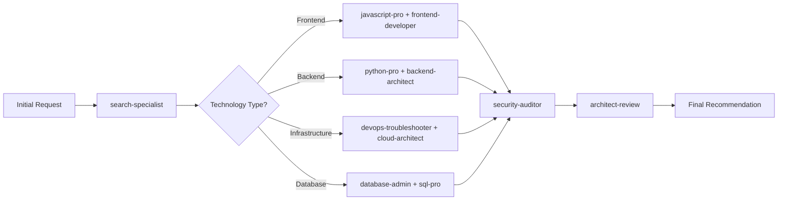

# Agent Collaboration Patterns for Technology Selection

Systematic multi-agent workflows for comprehensive technology evaluation and implementation.

## Core Collaboration Framework

### The Technology Selection Pipeline



## Pattern 1: Sequential Evaluation Chain

### Use Case: New Technology Adoption

**Process Flow:**

1. **search-specialist**: Initial research and landscape analysis
2. **Technical Specialist**: Deep technical evaluation
3. **security-auditor**: Security assessment
4. **architect-review**: Architectural impact analysis
5. **Integration Specialist**: Implementation planning

**Example: Adopting a New Frontend Framework**

````markdown
## Agent Sequence

### Phase 1: Research (search-specialist)

**Input**: "Evaluate React 18 vs Vue 3 vs Svelte for new project"
**Output**:

- GitHub repository analysis
- Community health metrics
- Version stability assessment
- Documentation quality review

**Context Handoff to javascript-pro**:

```json
{
  "research_summary": "3 frameworks evaluated",
  "candidates": ["React 18.2", "Vue 3.3", "Svelte 4.0"],
  "github_metrics": {...},
  "initial_recommendation": "React 18 for ecosystem, Vue 3 for simplicity",
  "constraints": ["TypeScript required", "Node.js 20", "Windows DevContainer"]
}
```
````

### Phase 2: Technical Deep Dive (javascript-pro)

**Input**: Research context + technical constraints
**Focus**: Implementation patterns, toolchain integration, performance
**Output**:

- Code examples and patterns
- Bundle size analysis
- TypeScript integration assessment
- Development experience comparison

**Context Handoff to security-auditor**:

```json
{
  "technical_analysis": {...},
  "recommended_framework": "React 18.2",
  "security_considerations": ["XSS prevention", "dependency vulnerabilities"],
  "implementation_approach": "Create React App with TypeScript"
}
```

### Phase 3: Security Review (security-auditor)

**Input**: Technical analysis + security focus areas
**Focus**: Vulnerability history, secure patterns, dependency security
**Output**:

- Security risk assessment
- Secure configuration guidelines
- Dependency audit results
- Security monitoring recommendations

**Context Handoff to architect-review**:

```json
{
  "security_assessment": "APPROVED with conditions",
  "security_requirements": [...],
  "monitoring_setup": [...],
  "compliance_notes": [...]
}
```

### Phase 4: Architecture Review (architect-review)

**Input**: Complete technical and security analysis
**Focus**: System integration, scalability, maintainability
**Output**:

- Architectural fit assessment
- Integration strategy
- Long-term maintenance plan
- Migration roadmap

### Phase 5: Final Recommendation

**Consolidated Output**: Complete technology specification with implementation plan

```

## Pattern 2: Parallel Expert Consultation

### Use Case: Complex Technology Stack Decision

**Process Flow:**
```

search-specialist (Initial Research)
↓
Task Distribution
├── javascript-pro (Frontend Analysis)
├── python-pro (Backend Analysis)
├── database-admin (Data Layer Analysis)
└── devops-troubleshooter (Infrastructure Analysis)
↓
Results Consolidation
↓
security-auditor (Cross-cutting Security Review)
↓
architect-review (System Integration Analysis)

````

**Example: Full-Stack Technology Selection**

```markdown
## Parallel Analysis Workflow

### Initial Distribution (search-specialist)
**Task**: "Design technology stack for e-commerce platform"
**Research Output**: Technology landscape for each layer
**Distribution Strategy**:
- Frontend layer → javascript-pro
- Backend API layer → python-pro
- Database layer → database-admin
- Infrastructure layer → devops-troubleshooter

### Parallel Expert Analysis

#### Frontend Track (javascript-pro)
**Focus**: React ecosystem, state management, UI libraries
**Output**:
```json
{
  "frontend_stack": {
    "framework": "Next.js 14",
    "state_management": "Zustand",
    "ui_library": "Tailwind CSS + Headless UI",
    "testing": "Jest + React Testing Library"
  },
  "integration_points": ["API layer", "authentication", "routing"]
}
````

#### Backend Track (python-pro)

**Focus**: FastAPI vs Django, async patterns, API design
**Output**:

```json
{
  "backend_stack": {
    "framework": "FastAPI 0.104",
    "orm": "SQLAlchemy 2.0 with async",
    "auth": "JWT with FastAPI-Users",
    "testing": "pytest + httpx"
  },
  "integration_points": ["database", "frontend API", "external services"]
}
```

#### Database Track (database-admin)

**Focus**: PostgreSQL vs MySQL, schema design, caching
**Output**:

```json
{
  "database_stack": {
    "primary": "PostgreSQL 16",
    "caching": "Redis 7",
    "search": "PostgreSQL full-text search",
    "migrations": "Alembic"
  },
  "integration_points": ["ORM", "caching layer", "search functionality"]
}
```

#### Infrastructure Track (devops-troubleshooter)

**Focus**: Deployment, monitoring, scaling
**Output**:

```json
{
  "infrastructure_stack": {
    "containerization": "Docker + Docker Compose",
    "deployment": "GitHub Actions",
    "monitoring": "Prometheus + Grafana",
    "hosting": "DigitalOcean Droplets"
  },
  "integration_points": ["CI/CD", "environment configuration", "monitoring"]
}
```

### Consolidation and Cross-cutting Analysis

#### Security Review (security-auditor)

**Input**: All stack recommendations
**Focus**: Cross-layer security, authentication flow, data protection
**Output**: Security architecture with specific configurations

#### Architecture Review (architect-review)

**Input**: Complete stack + security requirements
**Focus**: System boundaries, data flow, scalability planning
**Output**: Final integrated architecture recommendation

```

## Pattern 3: Iterative Refinement

### Use Case: Technology Migration Planning

**Process Flow:**
```

Current State Analysis → Gap Analysis → Migration Strategy → Risk Assessment → Implementation Plan

````

**Agent Rotation:**
- **Round 1**: Current state documentation (relevant specialists)
- **Round 2**: Target state research (search-specialist + specialists)
- **Round 3**: Migration planning (architect-review + specialists)
- **Round 4**: Risk mitigation (security-auditor + relevant specialists)

## Pattern 4: Problem-Driven Selection

### Use Case: Performance Issue Resolution

**Trigger**: "Application has performance bottlenecks"

**Dynamic Agent Selection:**
```markdown
1. performance-engineer: Identifies bottleneck categories
2. Specialist routing based on bottleneck type:
   - Database → database-optimizer + sql-pro
   - Frontend → javascript-pro + frontend-developer
   - Backend → python-pro + backend-architect
   - Infrastructure → devops-troubleshooter + cloud-architect
3. search-specialist: Research alternative technologies for problematic areas
4. architect-review: Assess architectural changes required
5. security-auditor: Ensure performance fixes don't introduce security issues
````

## Context Management Strategies

### Context Preservation Patterns

#### 1. Context Handoff Chain

```json
{
  "session_id": "tech-eval-2024-001",
  "previous_agent": "search-specialist",
  "current_agent": "javascript-pro",
  "context": {
    "technology_candidates": [...],
    "evaluation_criteria": [...],
    "constraints": [...],
    "preliminary_findings": [...]
  },
  "next_agent": "security-auditor"
}
```

#### 2. Shared Context Document

```markdown
# Technology Evaluation Context: Project Alpha

## Evaluation Session: 2024-07-30

## Agents Involved: search-specialist → javascript-pro → security-auditor → architect-review

## Current Status: Phase 2 - Technical Deep Dive

## Previous Phase Results:

- search-specialist: [findings summary]

## Current Phase:

- javascript-pro: [in progress - technical analysis]

## Next Phase:

- security-auditor: [planned - security review]

## Accumulated Context:

[All previous findings and decisions]
```

#### 3. Decision Trail Documentation

```markdown
## Decision Trail

### Decision Point 1: Framework Selection

- **Decision**: React 18 over Vue 3
- **Deciding Agent**: javascript-pro
- **Rationale**: Better TypeScript integration, larger ecosystem
- **Dissenting Views**: search-specialist noted Vue's simpler learning curve
- **Supporting Evidence**: [GitHub analysis, performance benchmarks]

### Decision Point 2: State Management

- **Decision**: Zustand over Redux Toolkit
- **Deciding Agent**: javascript-pro
- **Rationale**: Simpler API, better TypeScript support, smaller bundle
- **Validation Required**: architect-review for scalability implications
```

## Quality Assurance Patterns

### Multi-Agent Validation

#### 1. Expert Review Chain

```
Primary Analysis → Peer Review → Cross-Domain Validation → Final Approval
```

#### 2. Devil's Advocate Pattern

```
Recommendation → Contrarian Analysis → Synthesis → Refined Recommendation
```

#### 3. Implementation Validation

```
Technology Selection → Prototype Implementation → Real-world Testing → Adjustment
```

## Agent Coordination Templates

### Coordination Message Templates

#### Research Request Template

```markdown
## Agent Coordination Request

**From**: search-specialist
**To**: javascript-pro
**Subject**: React 18 Technical Deep Dive

### Context Summary

- **Project**: [description]
- **Current Phase**: Technical evaluation following initial research
- **Time Constraints**: [timeline]

### Research Findings to Date

- [Previous agent findings]

### Specific Focus Areas for javascript-pro

1. TypeScript integration quality
2. Performance characteristics vs Vue 3
3. Ecosystem maturity (testing, tooling, libraries)
4. Migration effort from current stack

### Expected Deliverables

- Technical implementation assessment
- Performance comparison data
- Toolchain integration analysis
- Risk/benefit analysis

### Next Agent in Chain

- security-auditor (security review)
- Expected handoff: [timeline]
```

#### Handoff Template

```markdown
## Agent Handoff: javascript-pro → security-auditor

### Completed Analysis Summary

- **Technology Evaluated**: React 18.2 with TypeScript
- **Recommendation Status**: APPROVED for technical implementation
- **Key Findings**: [bullet points]

### Security Focus Areas Identified

1. Dependency vulnerability management
2. XSS prevention patterns
3. Authentication integration
4. Data validation strategies

### Context for Security Review

- **Implementation Approach**: [details]
- **Dependencies of Concern**: [list]
- **Security Requirements**: [from project requirements]
- **Compliance Needs**: [if applicable]

### Questions for Security Team

1. [Specific security questions raised during technical analysis]

### Continuation Context

- **Next Agent**: architect-review
- **Timeline**: [expected completion]
- **Final Deliverable**: Complete technology specification
```

This collaboration framework ensures systematic, thorough technology evaluation while maximizing the expertise of each specialized agent within the existing Claude Code environment.
