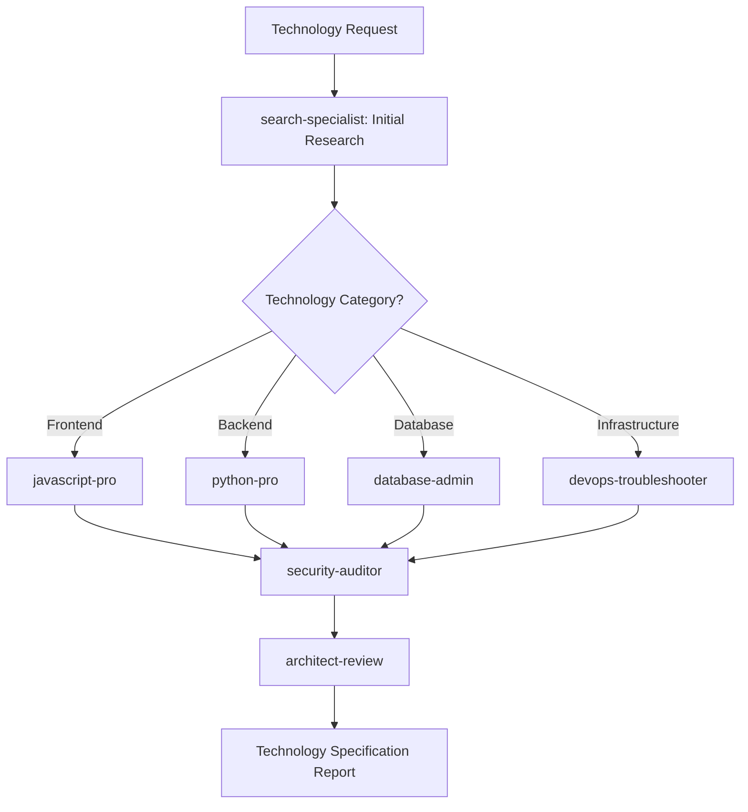
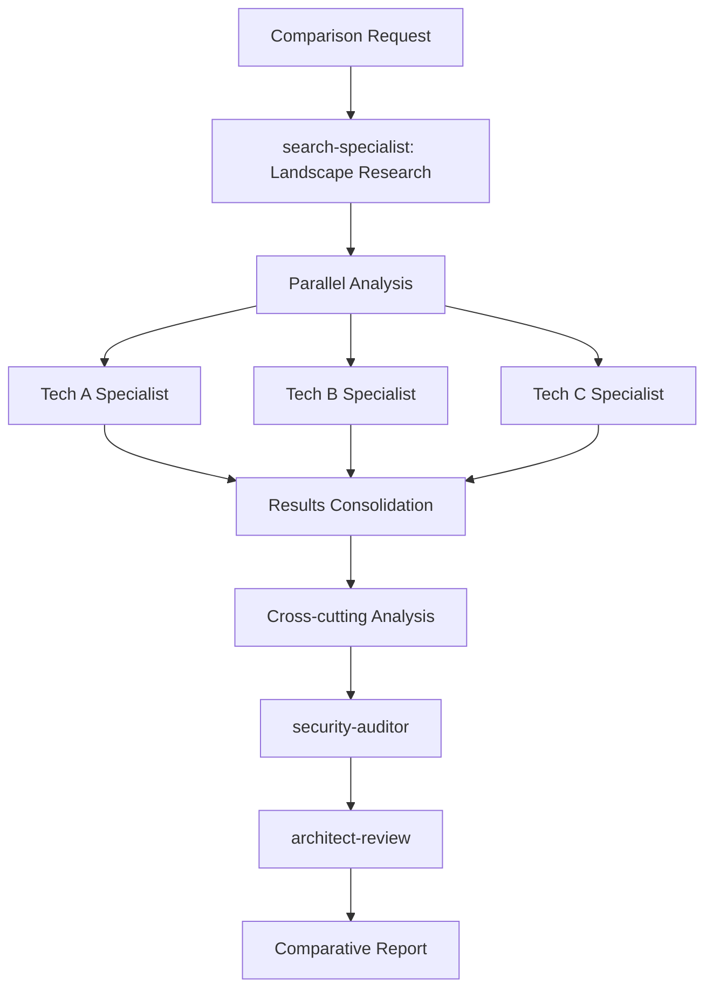
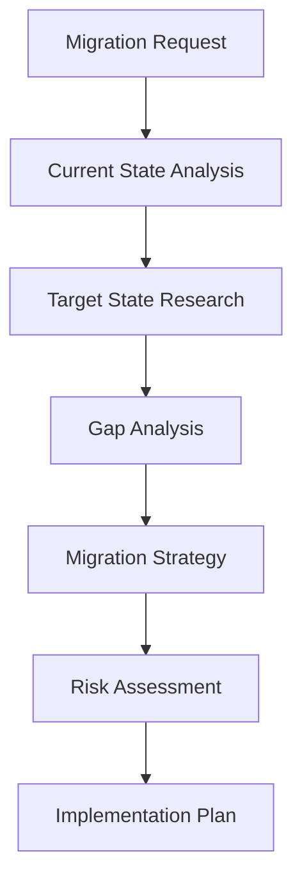

# Technology Research Workflow Orchestrator

Specialized orchestration for systematic technology evaluation and implementation planning.

## Technology Evaluation Workflows

### Workflow 1: Single Technology Assessment

**Trigger**: `/tech-spec [technology_name]`



**Stage Definitions:**

#### Stage 1: Research Initiation

- **Agent**: search-specialist
- **Duration**: 15-30 minutes
- **Quality Gate**: Minimum 5 GitHub sources analyzed
- **Deliverables**:
  - Technology landscape analysis
  - Version stability assessment
  - Community health metrics
  - Initial recommendation matrix

#### Stage 2: Technical Deep Dive

- **Agent**: Domain specialist (auto-selected)
- **Duration**: 30-45 minutes
- **Quality Gate**: Technical implementation plan provided
- **Deliverables**:
  - Implementation complexity assessment
  - Performance characteristics analysis
  - Integration requirements documentation
  - Migration effort estimation

#### Stage 3: Security Assessment

- **Agent**: security-auditor
- **Duration**: 20-30 minutes
- **Quality Gate**: Security risk assessment completed
- **Deliverables**:
  - Vulnerability history analysis
  - Secure configuration guidelines
  - Compliance validation
  - Risk mitigation strategies

#### Stage 4: Architecture Review

- **Agent**: architect-review
- **Duration**: 20-30 minutes
- **Quality Gate**: Architectural impact assessed
- **Deliverables**:
  - System integration analysis
  - Scalability assessment
  - Long-term maintenance planning
  - Technology debt evaluation

#### Stage 5: Specification Generation

- **Orchestrator**: Consolidated report generation
- **Duration**: 10-15 minutes
- **Quality Gate**: Complete specification document
- **Deliverables**:
  - Executive summary with recommendation
  - Implementation roadmap
  - Risk assessment matrix
  - Next steps action plan

### Workflow 2: Comparative Technology Analysis

**Trigger**: `/tech-spec "Technology A vs Technology B vs Technology C"`



**Parallel Evaluation Strategy:**

#### Phase 1: Simultaneous Research (search-specialist)

```markdown
Research Distribution:

- Technology A: GitHub ecosystem analysis
- Technology B: GitHub ecosystem analysis
- Technology C: GitHub ecosystem analysis

Standardized Metrics:

- Stars, forks, contributors
- Release frequency and stability
- Issue resolution patterns
- Documentation quality
- Community engagement
```

#### Phase 2: Parallel Technical Analysis

```markdown
Agent Assignment:

- Each technology → Appropriate specialist agent
- Standardized evaluation criteria
- Consistent output format
- Synchronized completion timeline

Evaluation Matrix:
| Criteria | Tech A | Tech B | Tech C |
|----------|--------|--------|--------|
| Performance | [score] | [score] | [score] |
| Learning Curve | [score] | [score] | [score] |
| Ecosystem | [score] | [score] | [score] |
| Maintenance | [score] | [score] | [score] |
```

#### Phase 3: Consolidated Analysis

```markdown
Cross-cutting Evaluation:

- Security posture comparison
- Architectural fit assessment
- Migration effort analysis
- Long-term strategic alignment

Final Recommendation:

- Ranked preferences with rationale
- Use case specific recommendations
- Implementation timeline for each option
```

### Workflow 3: Technology Migration Planning

**Trigger**: `/tech-spec "migrate from [current] to [target]"`



**Migration Workflow Stages:**

#### Stage 1: Current State Documentation

- **Multi-Agent**: Relevant specialists for current tech
- **Focus**: Document existing implementation, dependencies, customizations
- **Output**: Current state inventory and dependency map

#### Stage 2: Target Technology Research

- **Agent**: search-specialist + target tech specialist
- **Focus**: Target technology capabilities, requirements, constraints
- **Output**: Target state specification and requirements

#### Stage 3: Gap Analysis

- **Agent**: architect-review + relevant specialists
- **Focus**: Identify incompatibilities, missing features, breaking changes
- **Output**: Detailed gap analysis with migration complexity assessment

#### Stage 4: Migration Strategy Development

- **Multi-Agent**: All relevant specialists coordinated
- **Focus**: Phased migration approach, rollback strategies, testing plans
- **Output**: Comprehensive migration strategy document

#### Stage 5: Risk Assessment and Mitigation

- **Agent**: security-auditor + risk-manager + relevant specialists
- **Focus**: Identify risks, develop mitigation strategies, create contingency plans
- **Output**: Risk register with mitigation strategies

## Orchestration Templates

### Agent Coordination Script Template

```bash
#!/bin/bash
# Technology Evaluation Orchestrator

TECH_NAME="$1"
EVALUATION_TYPE="$2" # single|comparison|migration
SESSION_ID="tech-eval-$(date +%Y%m%d-%H%M%S)"

# Stage 1: Initialize Research
echo "🔍 Starting technology evaluation: $TECH_NAME"
echo "📋 Session ID: $SESSION_ID"

# Create evaluation context
mkdir -p .claude/tech-evaluations/$SESSION_ID

# Stage 1: Research Phase
echo "📊 Phase 1: Initial Research (search-specialist)"
claude task --agent search-specialist \
    --prompt "Research $TECH_NAME technology for evaluation. Focus on GitHub sources, versions, community health." \
    --output ".claude/tech-evaluations/$SESSION_ID/01-research.md"

# Stage 2: Technical Analysis
echo "🔧 Phase 2: Technical Deep Dive"
TECH_CATEGORY=$(detect_technology_category "$TECH_NAME")
claude task --agent "$TECH_CATEGORY-pro" \
    --context ".claude/tech-evaluations/$SESSION_ID/01-research.md" \
    --prompt "Perform technical evaluation of $TECH_NAME based on research context." \
    --output ".claude/tech-evaluations/$SESSION_ID/02-technical.md"

# Stage 3: Security Assessment
echo "🔒 Phase 3: Security Review"
claude task --agent security-auditor \
    --context ".claude/tech-evaluations/$SESSION_ID/01-research.md,.claude/tech-evaluations/$SESSION_ID/02-technical.md" \
    --prompt "Conduct security assessment of $TECH_NAME technology." \
    --output ".claude/tech-evaluations/$SESSION_ID/03-security.md"

# Stage 4: Architecture Review
echo "🏗️ Phase 4: Architecture Assessment"
claude task --agent architect-review \
    --context ".claude/tech-evaluations/$SESSION_ID/*.md" \
    --prompt "Evaluate architectural implications of adopting $TECH_NAME." \
    --output ".claude/tech-evaluations/$SESSION_ID/04-architecture.md"

# Stage 5: Consolidation
echo "📋 Phase 5: Report Generation"
claude task --agent workflow-orchestrator \
    --context ".claude/tech-evaluations/$SESSION_ID/*.md" \
    --prompt "Generate comprehensive technology specification report for $TECH_NAME." \
    --output ".claude/tech-evaluations/$SESSION_ID/final-specification.md"

echo "✅ Technology evaluation completed: .claude/tech-evaluations/$SESSION_ID/final-specification.md"
```

### Quality Gate Validation

````markdown
## Quality Gates for Technology Evaluation

### Gate 1: Research Completeness

**Criteria**:

- [ ] Minimum 5 GitHub sources analyzed
- [ ] Latest stable version identified
- [ ] Community health metrics gathered
- [ ] Basic security posture assessed
- [ ] Documentation quality evaluated

**Validation**:

```bash
validate_research_quality() {
    local research_file="$1"
    local sources_count=$(grep -c "github.com" "$research_file")
    local has_version=$(grep -q "version.*:" "$research_file" && echo "true" || echo "false")
    local has_metrics=$(grep -q "stars\|forks\|contributors" "$research_file" && echo "true" || echo "false")

    if [[ $sources_count -ge 5 && $has_version == "true" && $has_metrics == "true" ]]; then
        echo "✅ Research quality gate passed"
        return 0
    else
        echo "❌ Research quality gate failed"
        return 1
    fi
}
```
````

### Gate 2: Technical Analysis Depth

**Criteria**:

- [ ] Implementation complexity assessed
- [ ] Performance characteristics documented
- [ ] Integration requirements specified
- [ ] Migration effort estimated
- [ ] Code examples provided (where applicable)

### Gate 3: Security Validation

**Criteria**:

- [ ] Vulnerability history analyzed
- [ ] Secure configuration guidelines provided
- [ ] Compliance requirements addressed
- [ ] Risk mitigation strategies defined

### Gate 4: Architecture Alignment

**Criteria**:

- [ ] System integration impact assessed
- [ ] Scalability implications documented
- [ ] Long-term maintenance plan provided
- [ ] Technology debt implications evaluated

````

## Automation Rules

### Automatic Progression Rules

```yaml
progression_rules:
  research_to_technical:
    condition: "research_quality_gate_passed AND agent_available"
    action: "trigger_technical_analysis"

  technical_to_security:
    condition: "technical_analysis_complete AND no_blocking_issues"
    action: "trigger_security_review"

  security_to_architecture:
    condition: "security_assessment_complete AND risk_level < HIGH"
    action: "trigger_architecture_review"

  architecture_to_final:
    condition: "architecture_review_complete"
    action: "generate_specification_report"
````

### Escalation Rules

```yaml
escalation_rules:
  high_security_risk:
    condition: "security_risk_level == HIGH"
    action: "escalate_to_security_team"
    notification: "High security risk identified in technology evaluation"

  performance_concerns:
    condition: "performance_rating < ACCEPTABLE"
    action: "escalate_to_performance_engineer"
    notification: "Performance concerns require additional analysis"

  architecture_mismatch:
    condition: "architecture_fit_score < THRESHOLD"
    action: "escalate_to_senior_architect"
    notification: "Technology may not align with current architecture"
```

## Progress Monitoring

### Evaluation Progress Dashboard

```markdown
# Technology Evaluation Progress

## Session: tech-eval-20240730-143052

## Technology: React 18 vs Vue 3 Comparison

### Progress Overview

- [x] Research Phase (search-specialist) - ✅ Completed
- [x] Technical Analysis (javascript-pro) - ✅ Completed
- [x] Security Review (security-auditor) - ✅ Completed
- [ ] Architecture Review (architect-review) - 🔄 In Progress
- [ ] Final Report Generation - ⏳ Pending

### Quality Gates Status

- [x] Research Completeness - ✅ 8 sources analyzed
- [x] Technical Analysis Depth - ✅ Implementation examples provided
- [x] Security Validation - ✅ No high-risk issues found
- [ ] Architecture Alignment - 🔄 In progress

### Timeline

- Start Time: 2024-07-30 14:30:52
- Current Duration: 1h 23m
- Estimated Completion: 2024-07-30 16:15:00

### Agent Utilization

- search-specialist: 28 minutes
- javascript-pro: 35 minutes
- security-auditor: 20 minutes
- architect-review: In progress (est. 25 minutes)
```

### Automated Status Updates

```bash
# Status update script
update_evaluation_status() {
    local session_id="$1"
    local current_stage="$2"
    local status="$3"

    # Update progress tracking
    echo "$(date): $current_stage - $status" >> .claude/tech-evaluations/$session_id/progress.log

    # Check for delays
    check_timeline_adherence "$session_id"

    # Send notifications if needed
    if [[ "$status" == "BLOCKED" ]]; then
        notify_escalation "$session_id" "$current_stage"
    fi
}
```

This orchestration framework provides systematic, automated technology evaluation while maintaining quality standards and clear progress visibility.
